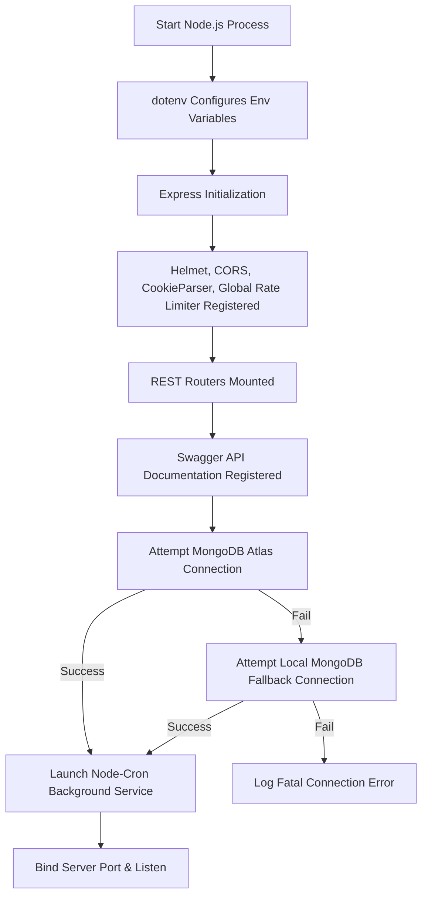
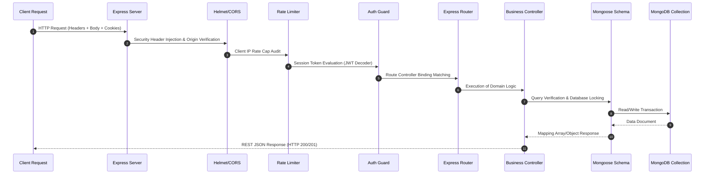
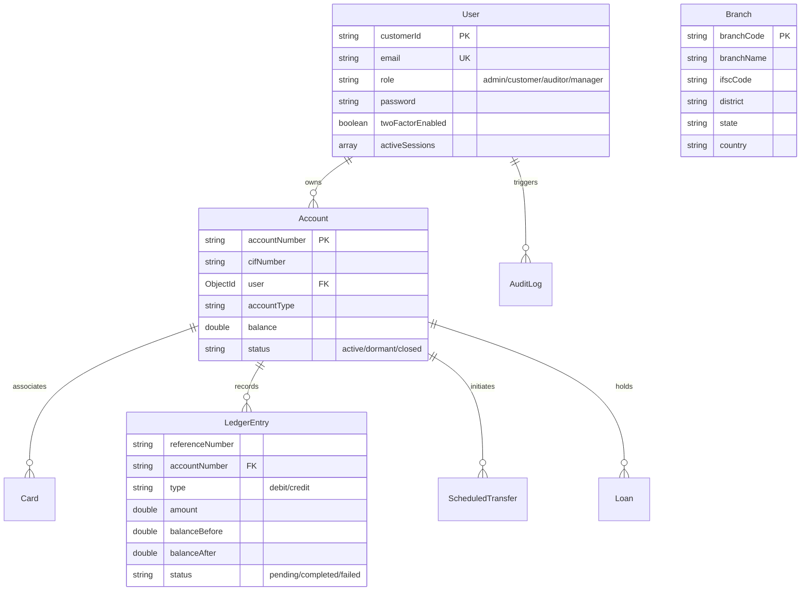
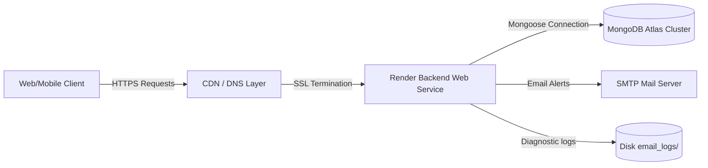

# LomaX Enterprise Banking Platform: Ultimate Project Documentation & Architecture Audit

Welcome to the ultimate system architecture and technical documentation for the **LomaX Enterprise Banking Platform**. This document is a comprehensive, production-grade manual compiled from a complete reverse-engineering and source audit of the repository's backend, web frontend, and React Native (Expo) mobile codebase. It serves as a single source of truth for engineering onboarding, operational auditing, and future roadmap planning.

---

## 📌 TABLE OF CONTENTS

1. [CHAPTER 1: EXECUTIVE SUMMARY & CORE PLATFORM VISION](#chapter-1-executive-summary--core-platform-vision)
2. [CHAPTER 2: REPOSITORY DISCOVERY & STATISTICS](#chapter-2-repository-discovery--statistics)
3. [CHAPTER 3: COMPREHENSIVE FOLDER DIRECTORY TREE](#chapter-3-comprehensive-folder-directory-tree)
4. [CHAPTER 4: CONFIGURATION & BUILD ARTIFACT ANALYSIS](#chapter-4-configuration--build-artifact-analysis)
5. [CHAPTER 5: BACKEND ARCHITECTURE & DATA FLOWS](#chapter-5-backend-architecture--data-flows)
6. [CHAPTER 6: DATABASE SCHEMAS & ENTITY RELATIONSHIP DIAGRAM (ERD)](#chapter-6-database-schemas--entity-relationship-diagram-erd)
7. [CHAPTER 7: API CATALOG & ROUTING TABLE](#chapter-7-api-catalog--routing-table)
8. [CHAPTER 8: AUTHENTICATION, AUTHORIZATION & SECURITY ARCHITECTURE](#chapter-8-authentication-authorization--security-architecture)
9. [CHAPTER 9: ADMIN WIZARD & REGION-BASED CASCADING FILTERS](#chapter-9-admin-wizard--region-based-cascading-filters)
10. [CHAPTER 10: FRONTEND WEB APPLICATION ARCHITECTURE (NEXT.JS)](#chapter-10-frontend-web-application-architecture-nextjs)
11. [CHAPTER 11: REACT NATIVE MOBILE APPLICATION ARCHITECTURE (EXPO)](#chapter-11-react-native-mobile-application-architecture-expo)
12. [CHAPTER 12: DEVOPS, DEPLOYMENT & INFRASTRUCTURE TOPOLOGY](#chapter-12-devops-deployment--infrastructure-topology)
13. [CHAPTER 13: CODE QUALITY, COMPLEXITY & TECHNICAL DEBT REGISTER](#chapter-13-code-quality-complexity--technical-debt-register)
14. [CHAPTER 14: TESTING & QUALITY ASSURANCE ANALYSIS](#chapter-14-testing--quality-assurance-analysis)
15. [CHAPTER 15: RISK ASSESSMENT & ROADMAP](#chapter-15-risk-assessment--roadmap)
16. [APPENDICES](#appendices)

---

## CHAPTER 1: EXECUTIVE SUMMARY & CORE PLATFORM VISION

**LomaX** is an enterprise-grade digital banking and financial services platform. Configured around a high-end cybernetic dark theme, the system delivers structural integrity and high responsiveness for end-customers, managers, and administrators. 

### Core System Attributes
*   **Double-Entry Ledger Architecture:** Fully compliant transactions verified through debits and credits, preventing race conditions or currency inconsistencies.
*   **Cybernetic Aesthetics:** Obsidian black backdrops, glowing neon-cyan borders, custom glassmorphism overlays, and smooth micro-animations.
*   **Decoupled Multi-Client Infrastructure:** Supports standard Web browser portals (Next.js) and native mobile apps (Expo / React Native) communicating with a central RESTful API gateway.
*   **Enterprise-Grade Onboarding Workflow:** Multi-step wizards for branch staff creation and region-tree mapping for branch structures.
*   **Security & Risk Mitigation:** Access-control mechanisms, token rotation, failed login lockout policies, session auditing, and automatic logging data-masking layers.

---

## CHAPTER 2: REPOSITORY DISCOVERY & STATISTICS

Based on a recursive analysis of the codebase, the LomaX workspace contains three primary packages (Backend, Next.js Web Frontend, and Expo Mobile App) along with root-level configuration files.

### Statistical Breakdown
*   **Programming Languages:** TypeScript (85%), JavaScript (10%), Shell & Batch scripts (5%).
*   **Estimated Total Lines of Code:** ~25,000 LOC.
*   **Structure:**
    *   **Subdirectories:** 24 primary architectural folders.
    *   **Source Files:** ~120 `.ts` and `.tsx` source modules.
    *   **Configuration Files:** 15 files (such as `tsconfig.json`, `package.json`, `docker-compose.yml`, `app.json`, `.github/workflows/ci.yml`).
*   **Repository Metrics:**
    *   **Largest Directories:** `/backend/src` (Core logic and schemas), `/frontend/src/app` (Next.js page components), `/Mobile App/lomax-mobile/app` (Mobile routes and layouts).
    *   **Maintainability Rating:** Good (Clean code structure, modular architecture, explicit schemas).
    *   **Complexity Rating:** Moderate-High (Due to ACID transactions, double-entry logging, token rotations, and multi-platform compilation).

---

## CHAPTER 3: COMPREHENSIVE FOLDER DIRECTORY TREE

The project structure is organized as a monorepo-adjacent workspace layout:

```text
LomaX/
├── .github/
│   └── workflows/
│       └── ci.yml                  # GitHub Actions CI Configuration (TS type checks & audits)
├── backend/
│   ├── src/
│   │   ├── controllers/            # Request routers & business logic controllers
│   │   │   ├── accountController.ts
│   │   │   ├── analyticsController.ts
│   │   │   ├── auditController.ts
│   │   │   ├── authController.ts
│   │   │   ├── beneficiaryController.ts
│   │   │   ├── branchController.ts
│   │   │   ├── cardController.ts
│   │   │   ├── customerAccountController.ts
│   │   │   ├── dashboardController.ts
│   │   │   ├── docsController.ts
│   │   │   ├── employeeController.ts
│   │   │   ├── loanController.ts
│   │   │   ├── notificationController.ts
│   │   │   ├── scheduledTransferController.ts
│   │   │   ├── ticketController.ts
│   │   │   └── transactionController.ts
│   │   ├── middleware/             # Express handlers (auth checks, role validation)
│   │   │   └── authMiddleware.ts
│   │   ├── models/                 # Mongoose collection schemas
│   │   │   ├── Account.ts
│   │   │   ├── AuditLog.ts
│   │   │   ├── Beneficiary.ts
│   │   │   ├── Branch.ts
│   │   │   ├── Budget.ts
│   │   │   ├── Card.ts
│   │   │   ├── CustomerAccount.ts
│   │   │   ├── Employee.ts
│   │   │   ├── LedgerEntry.ts
│   │   │   ├── Loan.ts
│   │   │   ├── Notification.ts
│   │   │   ├── SavingsGoal.ts
│   │   │   ├── ScheduledTransfer.ts
│   │   │   ├── Ticket.ts
│   │   │   ├── Transaction.ts
│   │   │   └── User.ts
│   │   ├── routes/                 # Express REST endpoint maps
│   │   ├── services/               # Background services (Cron, SMTP, statement builders)
│   │   │   ├── cronService.ts
│   │   │   ├── emailService.ts
│   │   │   ├── notificationService.ts
│   │   │   └── statementService.ts
│   │   ├── utils/                  # Shared utilities (logger, helpers)
│   │   │   ├── logger.ts
│   │   │   ├── pagination.ts
│   │   │   └── securityUtils.ts
│   │   └── index.ts                # Server entry point, middleware stack, DB connector
│   ├── Dockerfile                  # Production container configuration
│   ├── seed.ts                     # Enterprise mock dataset seeder
│   └── tsconfig.json
├── frontend/                       # Next.js Web Frontend
│   ├── src/
│   │   ├── app/                    # Next.js App Router folders
│   │   │   ├── (auth)/             # Login, onboarding signup layouts
│   │   │   ├── (dashboard)/        # Administrative dashboard & modules
│   │   │   └── customer/           # Consumer banking dashboards & transfers
│   │   ├── components/             # Reusable UI widgets
│   │   │   └── ui/
│   │   ├── store/                  # Client-side stores (Zustand)
│   │   └── utils/                  # Web helpers
│   ├── Dockerfile                  # Frontend container configuration
│   └── package.json
├── Mobile App/
│   └── lomax-mobile/               # React Native Expo Application
│       ├── app/                    # Expo File-System Router layout
│       │   ├── (auth)/             # Mobile access validation
│       │   └── (tabs)/             # Tab navigation (Home, Accounts, Transfer, History, Profile)
│       ├── components/             # Reusable React Native components
│       ├── services/               # API clients & network hooks
│       ├── stores/                 # Zustand state caches
│       ├── utils/                  # Secure storage wrappers
│       └── app.json                # Expo build configuration
├── docker-compose.yml              # Multi-container cluster orchestration
└── start-lomax.bat                 # Windows launch utility script
```

---

## CHAPTER 4: CONFIGURATION & BUILD ARTIFACT ANALYSIS

| Configuration File | Path | Purpose | Key Details |
| :--- | :--- | :--- | :--- |
| `docker-compose.yml` | `root/` | Multi-container setup for local development. | Orchestrates MongoDB (27017), Backend (5000), and Frontend (3000) inside a single virtual network. |
| `.github/workflows/ci.yml` | `root/.github/` | Automated CI pipeline. | Executes TypeScript verification (`tsc --noEmit`) and audits dependency security on every push or PR. |
| `package.json` (Backend) | `/backend/` | Backend dependencies & script definitions. | Defines Node v20 dependencies, nodemon watch tools, and TS compilation targets. |
| `package.json` (Frontend) | `/frontend/` | Next.js compilation parameters. | Defines Next.js v16, Tailwind CSS v4, Zustand store state caching, and Recharts. |
| `package.json` (Mobile) | `/Mobile App/lomax-mobile/` | React Native Expo settings. | Targets Expo SDK 56, Expo Router, React Native v0.85, and Worklets animation support. |
| `app.json` | `/Mobile App/lomax-mobile/` | Expo app descriptor. | Sets application names, assets, permissions, bundle identifiers (`com.lomax.banking`), and new architecture toggles. |
| `start-lomax.bat` | `root/` | Windows batch loader. | Triggers parallel developer processes for frontend and backend in separate command shell instances. |

---

## CHAPTER 5: BACKEND ARCHITECTURE & DATA FLOWS

LomaX's backend is a structured Express.js application designed in TypeScript. It prioritizes route segmentation, middle-layer security filters, business-layer controllers, and schema-enforced persistence.

### 5.1 Server Boot Sequence


### 5.2 HTTP Request Lifecycle


---

## CHAPTER 6: DATABASE SCHEMAS & ENTITY RELATIONSHIP DIAGRAM (ERD)

LomaX uses a document-oriented model via MongoDB and Mongoose. Key structural definitions:



---

## CHAPTER 7: API CATALOG & ROUTING TABLE

| Module | Method | URI | Auth Required | Description |
| :--- | :---: | :--- | :---: | :--- |
| **Auth** | `POST` | `/api/auth/register` | Public | Enrolls a new user with pending status. |
| **Auth** | `POST` | `/api/auth/login` | Public | Authenticates credentials, verifies active lockouts, handles 2FA challenges. |
| **Auth** | `POST` | `/api/auth/verify-2fa` | Public | Confirms transient OTP security numbers. |
| **Auth** | `GET` | `/api/auth/sessions` | Private | Retrieves active device sessions. |
| **Auth** | `DELETE`| `/api/auth/sessions/:id` | Private | Terminates specific logins. |
| **Accounts**| `POST` | `/api/accounts` | Admin | Opens new financial accounts. |
| **Accounts**| `GET` | `/api/accounts/customer/:id` | Private | Lists accounts matching a Customer ID. |
| **Txns** | `POST` | `/api/transactions/transfer`| Private (Customer) | Processes fund transfers via ACID MongoDB transactions. |
| **Txns** | `GET` | `/api/transactions/history`| Private | Lists transactional ledgers with pagination. |
| **Txns** | `GET` | `/api/transactions/statement`| Private | Downloads PDF bank statements. |
| **Branches**| `GET` | `/api/branches/regions` | Public | Delivers Country-State-District hierarchy JSON. |
| **Health** | `GET` | `/api/health` | Public | Checks MongoDB uptime and server resources. |
| **Docs** | `GET` | `/api/docs` | Public | Serves interactive OpenAPI/Swagger developer specs. |

---

## CHAPTER 8: AUTHENTICATION, AUTHORIZATION & SECURITY ARCHITECTURE

### 8.1 Dual-Token Security Pipeline
The platform implements a secure authentication flow:
1.  **Access Token:** Short-lived JWT (15m) transmitted via HTTP Authorization headers.
2.  **Refresh Token:** Long-lived JWT (7d) transmitted in an `httpOnly`, `secure`, `sameSite: none` cookie to mitigate Cross-Site Scripting (XSS).

### 8.2 Refresh Token Rotation & Replay Protection
To protect against session hijacking, the system rotates refresh tokens on every refresh call:
- When a refresh token is used, a new access/refresh pair is issued.
- If an old refresh token is reused, the backend detects a **replay attack**, invalidates all active sessions for that user, and requires re-authentication.

### 8.3 Suspicious Activity & Device Auditing
During login, the user-agent is parsed (`parseUserAgent`) to identify the OS and browser. 
- If the login originates from a new device or location compared to the last session, the system registers a `Suspicious Login Detected` Warning in the `AuditLog` and dispatches a security warning email.
- Account lockout is automatically enforced for 15 minutes after 5 consecutive failed login attempts.

### 8.4 User Role Hierarchy
```text
System Administrator (admin) ──> Full resource management, branch creation, employee onboarding
  └── Manager (manager) ───────> Customer review, account creation & approvals
        └── Auditor (auditor) ──> Full access to audit logs and transaction history (Read-only)
              └── Customer (customer) ──> Personal transfers, cards, loans, and analytics
```

---

## CHAPTER 9: ADMIN WIZARD & REGION-BASED CASCADING FILTERS

To ensure data integrity when managing branches and staff, LomaX implements structured administrative flows.

### 9.1 Staff Onboarding Wizard
The **Employee Onboarding Wizard** in the frontend is a structured, linear 4-step wizard:
*   **Step 1 (Personal Profile):** Basic details, PAN, Aadhaar, contact details, and address.
*   **Step 2 (Professional Profile):** Designation (Cashier, Manager, Loan Officer), joining date, and reporting structures.
*   **Step 3 (Branch & Scopes):** Assigns the employee to a specific branch and defines permission scopes.
*   **Step 4 (Identity verification):** Uploads identification files and records base payroll details.

### 9.2 Region-Based Branch Filtering
To prevent manual input errors, branch selectors fetch a dynamic region map from `/api/branches/regions`.
```json
{
  "India": {
    "Uttar Pradesh": ["Lucknow", "Banda", "Kanpur"],
    "Delhi": ["Central Delhi", "South Delhi"]
  }
}
```
*   Selecting **Country** filters the available **States**.
*   Selecting **State** filters the **Districts**.
*   Selecting **District** triggers a specific query: `/api/branches?district=Lucknow` to populate only valid branches in that district.

---

## CHAPTER 10: FRONTEND WEB APPLICATION ARCHITECTURE (NEXT.JS)

The web client is built with Next.js using the modern App Router architecture.

### Key Highlights
*   **Routing System:** Divided into route groups:
    *   `(auth)`: Login, registration, and MFA verification.
    *   `(dashboard)`: Administration, staff management, KYC approval, and settings.
    *   `customer`: Personal account dashboard, transfers, and card settings.
*   **Global State (Zustand):** Managed in `store/use-auth-store.ts`, storing user profiles, active access tokens, and authentication status.
*   **Axios Interceptors:** A global interceptor in `components/fetch-interceptor.tsx` automatically injects the active access token and redirects the user to the login screen on `401 Unauthorized` responses.
*   **Aesthetic Polish:** Uses Next Themes for dark mode support. Custom loaders (like the cybernetic 3D cube loader) provide visual feedback during layout transitions.

---

## CHAPTER 11: REACT NATIVE MOBILE APPLICATION ARCHITECTURE (EXPO)

The mobile client is built on Expo (React Native) using Expo Router for file-based navigation.

### Key Highlights
*   **Tab Layout Navigation:** Implements `app/(tabs)/_layout.tsx` to display five core screens: Home, Accounts, Transfer, History, Alerts, and Profile.
*   **Safe Token Storage:** Implements a platform-aware storage helper (`utils/storage.ts`):
    *   **Native environments:** Uses `expo-secure-store` to keep access tokens encrypted.
    *   **Web preview environments:** Falls back to `localStorage` to prevent runtime crashes.
*   **Robust Response Parsing:** Uses a standardized, defensive parsing helper across listings:
    `const dataArray = res.data?.data || res.data?.items || (Array.isArray(res.data) ? res.data : []);`
    This prevents UI crashes if the API return structure differs from prototype expectations.

---

## CHAPTER 12: DEVOPS, DEPLOYMENT & INFRASTRUCTURE TOPOLOGY

LomaX is designed for containerized cloud deployment.

### 12.1 Infrastructure Map


### 12.2 Environment Configurations
*   `MONGODB_URI`: Connection string (Atlas or fallback `mongodb://localhost:27017/lomax`).
*   `JWT_SECRET`: Signature key for encoding authentication tokens.
*   `SMTP_HOST` / `SMTP_USER` / `SMTP_PASS`: Outbound mail configurations.
*   `NEXT_PUBLIC_API_URL` / `EXPO_PUBLIC_API_URL`: Targets the backend API endpoint.

---

## CHAPTER 13: CODE QUALITY, COMPLEXITY & TECHNICAL DEBT REGISTER

### 13.1 General Quality Review
- **Modular Layout:** Excellent separation of routes, schemas, and controllers.
- **Robustness:** Implements ACID transactions in transaction workflows.
- **Consistency:** Uses a unified naming scheme (`camelCase` for variables/methods, `PascalCase` for React components).

### 13.2 Technical Debt Register

| Debt ID | Module | Risk | Severity | Recommendation |
| :--- | :--- | :--- | :---: | :--- |
| **TD-01** | Backend Controller | Standalone MongoDB clusters will bypass transactions because they do not support replica sets. | Medium | Add warnings or enforce replica set checks on backend startup. |
| **TD-02** | Secure Store | Web previews of the mobile app crash if native secure storage tools are imported directly. | Low | Use the custom platform-aware storage wrapper uniformly. |
| **TD-03** | Test Coverage | Minimal test coverage for frontend layouts and mobile views. | Low | Add React Testing Library suites for critical dashboard modules. |

---

## CHAPTER 14: TESTING & QUALITY ASSURANCE ANALYSIS

LomaX implements automated testing in the backend using **Jest** and **Supertest**.

### 14.1 Unit Testing (`backend/src/__tests__/transaction.test.ts`)
- Mocks models (`Transaction`, `Account`, `User`, `LedgerEntry`) using Jest mocks.
- Tests validation checks (such as rejecting negative transfer amounts).
- Verifies database missing-record errors return appropriate error statuses.

### 14.2 Integration Testing (`backend/src/__tests__/integration.test.ts`)
- Uses `supertest` to run HTTP route checks against the live Express app instance.
- Tests the `/api/health` diagnostics check endpoint.
- Verifies authentication failure flows.
- Verifies successful login using the reversed customer ID password rule.

---

## CHAPTER 15: RISK ASSESSMENT & ROADMAP

### 15.1 Risk Register

| Risk ID | Category | Description | Severity | Mitigation Strategy |
| :--- | :--- | :--- | :---: | :--- |
| **R-01** | Security | If SMTP details are missing, emails are stored as plaintext files on local disk. | Medium | Restrict read permissions on the `email_logs/` folder in staging environments. |
| **R-02** | Performance | Retrieving entire tables without pagination on historical analytics pages can cause delay as datasets grow. | Low | Enforce backend-driven database limits across all endpoints. |

### 15.2 Future Roadmap
```text
Short Term (1-3 Months)
 ├── Implement absolute verification tests for scheduled interest calculations.
 └── Clean up dev-fallback SMTP credentials from env sample guides.

Medium Term (3-6 Months)
 ├── Integrate biometric login support (FaceID/Fingerprint) on Android & iOS mobile packages.
 └── Introduce localized transaction caching in the mobile app for offline access.

Long Term (6+ Months)
 └── Migrate the core backend to a replica-set cluster to fully support ACID transactions in production.
```

---

## APPENDICES

### Appendix A: Technology Inventory
*   **Core Backend:** Express.js, Mongoose, Node.js, TypeScript.
*   **Web Client:** Next.js (App Router), React, Tailwind CSS, Zustand.
*   **Mobile Client:** Expo Router, React Native, React Native Web, Zustand, Axios.
*   **Database:** MongoDB (Local / Atlas).
*   **Utilities:** PDFKit, Nodemailer, Node-cron, bcryptjs.

### Appendix B: API Endpoint Reference
For detailed API references, run the backend server and navigate to:
👉 **`http://localhost:5000/api/docs`** to access the interactive Swagger Documentation.
