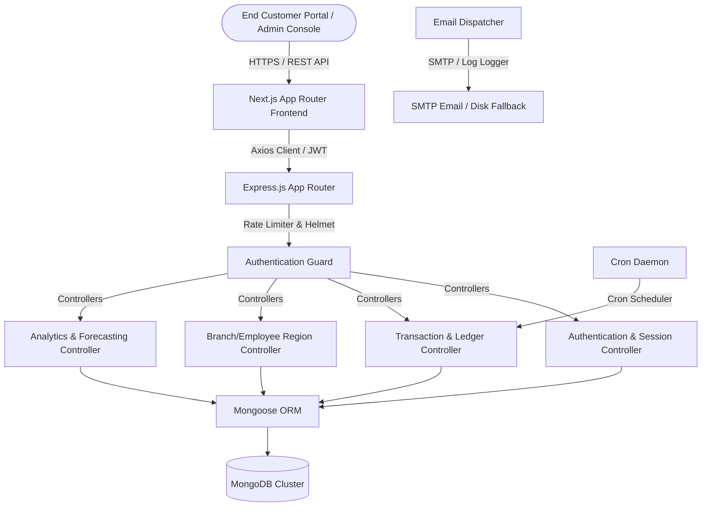
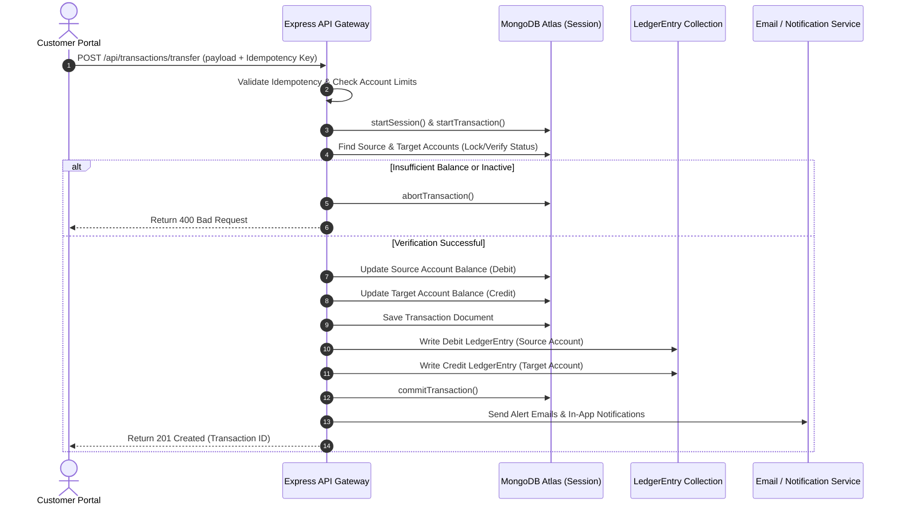

# LomaX Enterprise Banking Platform: Full Project & Technical Report

---

## Chapter 1: Executive Summary & Core Platform Vision

**LomaX** is an enterprise-grade, highly secure, modern digital banking platform. It features a stunning cybernetic, dark-mode design language, advanced transactional ledgers, region-based branch/staff assignment cascading filtering, progressive security modules (including active Session Management, Multi-Factor Authentication), automated background daemon processing, and robust containerized and serverless deployment pipelines.

The platform is engineered to fulfill standard financial specifications. Key attributes include:
*   **Double-Entry Ledger Integrity:** Guaranteed ledger-consistent transactions preventing race conditions.
*   **Aesthetic Dominance:** A premium dark UI featuring glassmorphism, responsive data grids, charts, custom loaders, and smooth micro-animations.
*   **Administrative Hierarchy:** Role-based controls permitting managers to onboard employees, audit actions, verify registrations, and maintain local branches.
*   **Cloud Native Orchestration:** Supports local deployment via `docker-compose` and production hosting on MongoDB Atlas, Render, and Netlify.

---

## Chapter 2: Comprehensive System Architecture

LomaX operates on a modern, decoupled client-server architecture. 



### 2.1 Component Interaction Detail
1.  **Frontend Shell:** Built in Next.js using Server-Side and Client-Side rendering. Global network requests are handled via a central Axios client (`api-client.ts`) which intercepts requests to inject JWT access tokens.
2.  **API Routing & Security Gateways:** Incoming requests on the Node.js/Express server pass through middleware security checks, including standard rate limiting (to block DDoS and brute force) and Helmet (to secure HTTP headers).
3.  **Authentication & Cryptographic Guards:** Requests to secure routes check the `authMiddleware.ts` guard. The middleware extracts JWT keys from cookies or headers and resolves user contexts.
4.  **Scheduled Daemon Workers:** The `cronService.ts` spins up a recurring time-scheduler utilizing `node-cron`. The daemon polls the database to process scheduled payments and calculate recurring interest configurations.
5.  **Audit Logs & Security Triggers:** Every database transaction or admin modification generates an `AuditLog` mapping the IP, severity, resource modified, and user details.

### 2.2 Sequence Diagram: Transaction Processing



---

## Chapter 3: Technology Stack & Package Analysis

### 3.1 Backend Configuration (`backend/package.json`)
The backend is built with **Node.js, Express, and Mongoose** in **TypeScript**.

```json
{
  "name": "backend",
  "version": "1.0.0",
  "dependencies": {
    "bcryptjs": "^3.0.3",
    "cookie-parser": "^1.4.7",
    "cors": "^2.8.6",
    "dotenv": "^17.4.2",
    "express": "^5.2.1",
    "express-rate-limit": "^8.5.2",
    "helmet": "^8.2.0",
    "jsonwebtoken": "^9.0.3",
    "mongoose": "^9.6.3",
    "node-cron": "^4.5.0",
    "nodemailer": "^9.0.1",
    "pdfkit": "^0.19.1"
  },
  "devDependencies": {
    "@types/bcryptjs": "^2.4.6",
    "@types/cookie-parser": "^1.4.10",
    "@types/cors": "^2.8.19",
    "@types/express": "^5.0.6",
    "@types/jsonwebtoken": "^9.0.10",
    "@types/node": "^25.9.1",
    "@types/node-cron": "^3.0.11",
    "@types/nodemailer": "^8.0.1",
    "@types/pdfkit": "^0.17.6",
    "nodemon": "^3.1.14",
    "ts-node": "^10.9.2",
    "typescript": "^6.0.3"
  }
}
```

*   **Express v5.2.1:** Uses the next-generation Express API to handle routing.
*   **Mongoose v9.6.3:** Manages schema validations and relations.
*   **Nodemailer v9.0.1:** Sends multi-format verification and transactional alerts.
*   **PDFKit v0.19.1:** Compiles transaction records into highly structured PDF bank statements.
*   **ts-node & nodemon:** Provide hot-reloading development support.

### 3.2 Frontend Configuration (`frontend/package.json`)
The frontend is built using **Next.js 16.2.7**, **React 19.2.4**, and **Zustand**.

```json
{
  "name": "frontend",
  "version": "0.1.0",
  "dependencies": {
    "@base-ui/react": "^1.5.0",
    "@hookform/resolvers": "^5.4.0",
    "@radix-ui/react-label": "^2.1.8",
    "@radix-ui/react-slot": "^1.2.4",
    "axios": "^1.17.0",
    "class-variance-authority": "^0.7.1",
    "clsx": "^2.1.1",
    "date-fns": "^4.4.0",
    "lucide-react": "^1.17.0",
    "next": "16.2.7",
    "next-themes": "^0.4.6",
    "react": "19.2.4",
    "react-day-picker": "^10.0.1",
    "react-dom": "19.2.4",
    "react-hook-form": "^7.77.0",
    "recharts": "^3.8.1",
    "shadcn": "^4.10.0",
    "sonner": "^2.0.7",
    "tailwind-merge": "^3.6.0",
    "tw-animate-css": "^1.4.0",
    "zod": "^4.4.3",
    "zustand": "^5.0.14"
  }
}
```

*   **Next.js v16.2.7:** Implements Server-Side Rendering (SSR) and Client-Side rendering.
*   **Zustand v5.0.14:** Manages simple, persistent, global state.
*   **Recharts v3.8.1:** Generates financial analytical charts.
*   **Zod & React Hook Form:** Validate user signups, transaction inputs, and configurations.

---

## Chapter 4: Comprehensive File Directory Map

```text
LomaX/
├── .github/
│   └── workflows/
│       └── ci.yml                  # CI pipeline mapping TypeScript checks & security audits
├── backend/
│   ├── src/
│   │   ├── controllers/            # Logic controllers managing requests
│   │   │   ├── accountController.ts          # Handles account lifecycle, status updates, routing
│   │   │   ├── analyticsController.ts        # Collects dashboard data and budget analytics
│   │   │   ├── auditController.ts            # Retrieves action histories for tracking
│   │   │   ├── authController.ts             # Contains login, registration, TOTP 2FA, session logic
│   │   │   ├── beneficiaryController.ts      # Configures payee databases for customers
│   │   │   ├── branchController.ts           # Configures bank physical branches and region lists
│   │   │   ├── cardController.ts             # Generates mock debit/credit cards and limits
│   │   │   ├── customerAccountController.ts  # Handles onboarding steps, workflows, and approvals
│   │   │   ├── dashboardController.ts        # Aggregates analytical parameters
│   │   │   ├── docsController.ts             # Serves interactive Swagger API Documentation
│   │   │   ├── employeeController.ts         # Manages employee credentials and branch scopes
│   │   │   ├── loanController.ts             # Directs loans applications and approvals
│   │   │   ├── notificationController.ts     # Feeds alerts to customer portals
│   │   │   ├── scheduledTransferController.ts# Manages scheduled payments
│   │   │   ├── ticketController.ts           # Handles support request systems
│   │   │   └── transactionController.ts      # Processes transfers, deposits, statement downloads
│   │   ├── middleware/
│   │   │   └── authMiddleware.ts   # Guard decrypting cookies/headers to assign request contexts
│   │   ├── models/                 # Mongoose schemas enforcing MongoDB structures
│   │   │   ├── Account.ts          # Model defining routing identifiers & services
│   │   │   ├── AuditLog.ts         # Records transactions and administrative operations
│   │   │   ├── Beneficiary.ts      # Contains user-configured target accounts
│   │   │   ├── Branch.ts           # Defines state, district, city, manager, and IFSC keys
│   │   │   ├── Budget.ts           # Limits expenditures per categories
│   │   │   ├── Card.ts             # Stores payment networks, CVVs, and international statuses
│   │   │   ├── CustomerAccount.ts  # Temporary customer profile during registration review
│   │   │   ├── Employee.ts         # Stores staff scopes, reporting managers, and credentials
│   │   │   ├── LedgerEntry.ts      # Double-entry ledger schemas
│   │   │   ├── Loan.ts             # Tracks application categories, monthly revenues, and tenures
│   │   │   ├── Notification.ts     # Standard alerts feed
│   │   │   ├── SavingsGoal.ts      # Tracks targets and aggregated funds
│   │   │   ├── ScheduledTransfer.ts# Configures background transactions
│   │   │   ├── Ticket.ts           # Manages queries categorized by priority and urgency
│   │   │   ├── Transaction.ts      # Records credit/debit double-entry listings
│   │   │   └── User.ts             # Stores login metrics, TOTP secrets, and session maps
│   │   ├── routes/                 # Connects HTTP routes to specific controllers
│   │   ├── services/
│   │   │   ├── cronService.ts      # System cron daemon resolving transfers
│   │   │   ├── emailService.ts     # SMTP client that fallbacks to disk logs on failure
│   │   │   ├── notificationService.ts # Dispatches alerts to database feeds
│   │   │   └── statementService.ts # Stream generator generating PDF and CSV statement data
│   │   ├── utils/
│   │   │   ├── logger.ts           # Custom structured logger with data masking
│   │   │   ├── pagination.ts       # Mongoose generic pagination helper
│   │   │   └── securityUtils.ts    # Hashing, token compilation, and TOTP generation
│   │   └── index.ts                # App initialization, database connection, and boot
│   ├── .env.example                # Template for environment parameters
│   ├── Dockerfile                  # Container configurations for backend
│   └── seed.ts                     # Database seeder (100+ customers, ledger transactions)
├── frontend/
│   ├── src/
│   │   ├── app/                    # Next.js App Router directories
│   │   │   ├── (auth)/             # Authentication components (Login, Registration, Verification)
│   │   │   ├── (dashboard)/        # Admin screens
│   │   │   │   ├── accounts/       # Account index, updates, deletions
│   │   │   │   ├── branches/       # Cascading branch selectors & management
│   │   │   │   ├── customers/      # List profiles, view applications, and approve KYC
│   │   │   │   ├── employees/      # Onboarding wizard for staff
│   │   │   │   ├── dashboard/      # Main administrative operations control
│   │   │   │   └── settings/       # Global toggles and server configs
│   │   │   ├── customer/           # Customer Portal
│   │   │   │   ├── dashboard/      # User analytics, recent transfers, balance history
│   │   │   │   ├── accounts/       # Manage internet/mobile features
│   │   │   │   ├── cards/          # Activate card, toggle online payments, set limits
│   │   │   │   └── transfer/       # Scheduled/Instant payment page
│   │   │   ├── globals.css         # Styling, dark color systems, custom scrollbars
│   │   │   └── layout.tsx          # Main entry wrapper injects background and themes
│   │   ├── components/
│   │   │   ├── ui/                 # Reusable interface components
│   │   │   │   ├── cube-loader.tsx # Cybernetic loading screen CSS
│   │   │   │   └── button.tsx      # Cybernetic button variants
│   │   │   ├── animated-background.tsx
│   │   │   └── fetch-interceptor.tsx  # Axios response validator
│   │   └── store/
│   │       └── use-auth-store.ts   # Zustand state manager
│   ├── Dockerfile                  # Multistage Next.js Docker configuration
│   └── tsconfig.json
├── docker-compose.yml              # Multi-container local execution system
└── start-lomax.bat                 # Windows quick-starter batch script
```

---

## Chapter 5: Database Schema & Data Models

### 5.1 User Model (`User.ts`)
```typescript
import mongoose, { Document, Schema } from 'mongoose';

export interface IUser extends Document {
  customerId: string;
  password?: string;
  role: 'admin' | 'customer' | 'auditor' | 'manager' | 'loan_officer';
  firstName: string;
  lastName: string;
  email: string;
  mobile: string;
  pan: string;
  aadhaar: string;
  status: 'pending' | 'active' | 'rejected';
  createdAt: Date;
  twoFactorEnabled: boolean;
  twoFactorSecret?: string;
  twoFactorBackupCodes?: string[];
  failedLoginAttempts: number;
  lockoutUntil?: Date;
  passwordHistory?: string[];
  activeSessions: Array<{
    sessionId: string;
    deviceName: string;
    browser: string;
    ipAddress: string;
    location: string;
    refreshToken: string;
    lastUsed: Date;
  }>;
}

const UserSchema: Schema = new Schema({
  customerId: { type: String, required: true, unique: true },
  password: { type: String }, 
  role: { type: String, enum: ['admin', 'customer', 'auditor', 'manager', 'loan_officer'], default: 'customer' },
  firstName: { type: String, required: true },
  lastName: { type: String, required: true },
  email: { type: String, required: true, unique: true },
  mobile: { type: String, required: true },
  pan: { type: String, required: true },
  aadhaar: { type: String, required: true },
  status: { type: String, enum: ['pending', 'active', 'rejected'], default: 'pending' },
  createdAt: { type: Date, default: Date.now },
  twoFactorEnabled: { type: Boolean, default: false },
  twoFactorSecret: { type: String },
  twoFactorBackupCodes: { type: [String], default: [] },
  failedLoginAttempts: { type: Number, default: 0 },
  lockoutUntil: { type: Date },
  passwordHistory: { type: [String], default: [] },
  activeSessions: {
    type: [{
      sessionId: { type: String, required: true },
      deviceName: { type: String, default: 'Unknown' },
      browser: { type: String, default: 'Unknown' },
      ipAddress: { type: String, default: '127.0.0.1' },
      location: { type: String, default: 'Local' },
      refreshToken: { type: String, required: true },
      lastUsed: { type: Date, default: Date.now }
    }],
    default: []
  }
});
export default mongoose.model<IUser>('User', UserSchema);
```

### 5.2 Account Model (`Account.ts`)
```typescript
import mongoose, { Document, Schema } from 'mongoose';

export interface IAccount extends Document {
  accountNumber: string;
  cifNumber: string;
  user: mongoose.Types.ObjectId;
  accountType: 'Savings Account' | 'Current Account' | 'Salary Account' | 'Fixed Deposit' | 'Recurring Deposit';
  balance: number;
  branchName: string;
  branchCode: string;
  ifscCode: string;
  status: 'active' | 'dormant' | 'closed';
  services: {
    debitCard: boolean;
    internetBanking: boolean;
    mobileBanking: boolean;
    smsAlerts: boolean;
    chequeBook: boolean;
    upi: boolean;
  };
  createdAt: Date;
}
```

### 5.3 LedgerEntry Model (`LedgerEntry.ts`)
```typescript
import mongoose, { Document, Schema } from 'mongoose';

export interface ILedgerEntry extends Document {
  referenceNumber: string; // Transaction reference ID
  accountNumber: string;   // LomaX Account Number or offset code
  type: 'debit' | 'credit';
  amount: number;
  balanceBefore: number;
  balanceAfter: number;
  remarks?: string;
  status: 'pending' | 'completed' | 'failed';
  createdAt: Date;
}

const LedgerEntrySchema: Schema = new Schema({
  referenceNumber: { type: String, required: true },
  accountNumber: { type: String, required: true },
  type: { type: String, enum: ['debit', 'credit'], required: true },
  amount: { type: Number, required: true },
  balanceBefore: { type: Number, required: true },
  balanceAfter: { type: Number, required: true },
  remarks: { type: String },
  status: { type: String, enum: ['pending', 'completed', 'failed'], default: 'completed' },
  createdAt: { type: Date, default: Date.now }
});

LedgerEntrySchema.index({ referenceNumber: 1, accountNumber: 1, type: 1 });
export default mongoose.model<ILedgerEntry>('LedgerEntry', LedgerEntrySchema);
```

---

## Chapter 6: API Endpoint Catalog

| Endpoint | HTTP Method | Roles Allowed | Description |
| :--- | :---: | :---: | :--- |
| `/api/auth/login` | `POST` | Public | Authenticates user, assigns cookies, runs suspicious activity detection alerts. |
| `/api/auth/register` | `POST` | Public | Registers pending profile, awaits admin review. |
| `/api/auth/change-password` | `POST` | All | Updates user password, checks password reuse history limits. |
| `/api/auth/verify-2fa` | `POST` | Public | Matches OTP codes, records dynamic browser sessions. |
| `/api/auth/sessions` | `GET` | All | Lists active logins, device metadata, IP scopes. |
| `/api/auth/sessions/:sessionId` | `DELETE` | All | Revokes targeting active session. |
| `/api/transactions/transfer` | `POST` | Customer | Transfers money atomically inside ACID transaction. |
| `/api/transactions/history` | `GET` | Customer, Auditor | Lists historical transactions with limit/page parameters. |
| `/api/health` | `GET` | Public | Diagnostic report of MongoDB latency and system resource scopes. |
| `/api/docs` | `GET` | Public | Serves Swagger API Documentation Interface. |

---

## Chapter 7: Core Engine & Business Logic Implementation

### 7.1 MongoDB ACID Transaction Manager
To guarantee financial operations are atomic, LomaX implements the `runInTransaction` wrapper:

```typescript
import mongoose from 'mongoose';

export async function runInTransaction<T>(
  actions: (session: mongoose.ClientSession) => Promise<T>
): Promise<T> {
  const session = await mongoose.startSession();
  try {
    session.startTransaction();
    const result = await actions(session);
    await session.commitTransaction();
    return result;
  } catch (error) {
    await session.abortTransaction();
    throw error;
  } finally {
    await session.endSession();
  }
}
```

### 7.2 Double-Entry Ledger Verification
Every transaction maps out to offset entries. For instance, an internal fund transfer:

```typescript
// Inside transaction controller:
await runInTransaction(async (session) => {
  // Update Source Account
  sAccount.balance -= transferAmount;
  await sAccount.save({ session });

  // Update Target Account
  tAccount.balance += transferAmount;
  await tAccount.save({ session });

  // Save Transaction
  const newTxn = new Transaction({...});
  await newTxn.save({ session });

  // Write Debit Entry
  const debitEntry = new LedgerEntry({
    referenceNumber: txnId,
    accountNumber: sAccount.accountNumber,
    type: 'debit',
    amount: transferAmount,
    balanceBefore: initialSourceBalance,
    balanceAfter: sAccount.balance
  });
  await debitEntry.save({ session });

  // Write Credit Entry
  const creditEntry = new LedgerEntry({
    referenceNumber: txnId,
    accountNumber: tAccount.accountNumber,
    type: 'credit',
    amount: transferAmount,
    balanceBefore: initialTargetBalance,
    balanceAfter: tAccount.balance
  });
  await creditEntry.save({ session });
});
```

---

## Chapter 8: Administrative Onboarding Wizard & Cascading Filters

### 8.1 Employee Onboarding Wizard
To simplify administrative tasks, the Employee Creation layout features a structured **Multi-Step Form Wizard**:
1.  **Step 1: Personal & Contact Information:** Collects names, birthdays, alternative numbers, and residential data.
2.  **Step 2: Employment Details:** Configures designations, joining dates, reporting managers, and employment status.
3.  **Step 3: Branch & Security Profiles:** Allows branch assignment and dynamically configures role scopes and permissions.
4.  **Step 4: Compensation & Identity Uploads:** Handles tax details, basic payroll configurations, and identity document uploads.

### 8.2 Cascading Dropdown Filters
In high-volume networks, rendering all branches in a single select menu can cause lag and selection errors. LomaX implements a **Cascading Selection System**:

1.  **Region Tree Fetch:** The dashboard queries `/api/branches/regions` to fetch a region map:
    ```json
    {
      "India": {
        "Uttar Pradesh": ["Lucknow", "Banda", "Kanpur"],
        "Delhi": ["Central Delhi", "South Delhi"]
      }
    }
    ```
2.  **Interactive Selection Flow:**
    *   Selecting a **Country** filters the **State** list.
    *   Selecting a **State** filters the **District** dropdown.
    *   Selecting a **District** queries `/api/branches?country=X&state=Y&district=Z` to display only the matching branch records.
3.  This hierarchy guarantees that staff assignments and customer registrations map to valid, existing branches.

---

## Chapter 9: Front-End User Experience & UI/UX Styling

### 9.1 CSS Cybernetic Theme Variables
LomaX uses Tailwind CSS paired with vanilla CSS variables to define its cybernetic aesthetic:

```css
:root {
  --background: #020617; /* Slate-950 */
  --foreground: #f8fafc; /* Slate-50 */
  --card: #0b1329;       /* Deep obsidian */
  --primary: #06b6d4;    /* Cyan-500 */
  --primary-glow: rgba(6, 182, 212, 0.15);
  --border: #1e293b;      /* Slate-800 */
}
```

### 9.2 Modern Dashboard Skeleton Loader
To eliminate screen layout shifts when data loads asynchronously, LomaX utilizes sleek, pulse-animated skeleton frameworks:

```tsx
export function DashboardSkeleton() {
  return (
    <div className="max-w-6xl mx-auto space-y-8 animate-pulse">
      <div className="flex justify-between items-center">
        <div className="space-y-2">
          <div className="h-8 w-64 bg-slate-900 rounded-lg"></div>
          <div className="h-4 w-40 bg-slate-900 rounded-lg"></div>
        </div>
        <div className="h-10 w-32 bg-slate-900 rounded-lg"></div>
      </div>
      <div className="grid grid-cols-1 lg:grid-cols-3 gap-8">
        <div className="lg:col-span-2 space-y-4">
          <div className="h-40 bg-slate-900 rounded-2xl"></div>
          <div className="h-40 bg-slate-900 rounded-2xl"></div>
        </div>
        <div className="lg:col-span-1 h-80 bg-slate-900 rounded-2xl"></div>
      </div>
    </div>
  );
}
```

---

## Chapter 10: Security Hardening & Threat Management

### 10.1 Refresh Token Rotation & Reuse Attack Mitigation
To mitigate session hijacking, LomaX rotates refresh tokens on every refresh API call. If a refresh token is reused, all active logins for the corresponding profile are terminated:

```typescript
// Inside authController.ts (refreshToken):
const activeSession = user.activeSessions.find(s => s.refreshToken === cookieToken);

if (!activeSession) {
  // Attack detected! Token reused or invalid. Revoke all active sessions.
  user.activeSessions = [];
  await user.save();
  res.clearCookie('refreshToken');
  res.status(403).json({ success: false, message: 'Replay attack detected. Sessions revoked.' });
  return;
}

// Generate new tokens and update active session
const newAccessToken = generateAccessToken(user._id, user.role, user.customerId);
const newRefreshToken = generateRefreshToken(user._id, user.role, user.customerId);

activeSession.refreshToken = newRefreshToken;
activeSession.lastUsed = new Date();
await user.save();
```

### 10.2 Logging Sanitization & Security Masking
To comply with global regulatory rules (PCI-DSS / SOC2), LomaX's logging engine automatically masks key credentials:

```typescript
const SENSITIVE_KEYS = ['password', 'cvv', 'cardnumber', 'pan', 'aadhaar', 'otp', 'token'];

export const maskSensitiveData = (obj: any): any => {
  if (!obj || typeof obj !== 'object') return obj;
  if (Array.isArray(obj)) return obj.map(maskSensitiveData);

  const masked: any = {};
  for (const key of Object.keys(obj)) {
    if (SENSITIVE_KEYS.includes(key.toLowerCase())) {
      masked[key] = '[MASKED]';
    } else if (typeof obj[key] === 'object') {
      masked[key] = maskSensitiveData(obj[key]);
    } else {
      masked[key] = obj[key];
    }
  }
  return masked;
};
```

---

## Chapter 11: Production Deployment & Infrastructure Setup

### 11.1 Render API Deployment (Backend)
1.  On the Render dashboard, create a new **Web Service**.
2.  Set the base directory parameter to `backend`.
3.  Add env keys:
    *   `MONGODB_URI`: Atlas Database connection URI.
    *   `JWT_SECRET`: Random 256-bit character string.
    *   `PORT`: `5000`
4.  Configure the build command to `npm install && npm run build` and start command to `npm start`.

### 11.2 Netlify Deployment (Frontend)
1.  Connect the repository directory `frontend` to Netlify.
2.  Set the build command to `npm run build` and publish directory to `.next`.
3.  Define the env parameter `NEXT_PUBLIC_API_URL` mapping to the active Render API Gateway URL.

---

## Chapter 12: System Diagnostics & Operations

1.  **Automated Seeding:** Populate staging environments by triggering the seeder:
    ```bash
    cd backend
    npm run seed
    ```
2.  **Diagnostics Monitoring:** Validate live system performance at `/api/health`. The system will return a structural health overview:
    ```json
    {
      "status": "ok",
      "timestamp": "2026-06-29T11:42:00.000Z",
      "uptime": 86400,
      "services": {
        "database": {
          "status": "connected",
          "pingMs": 12
        }
      }
    }
    ```
